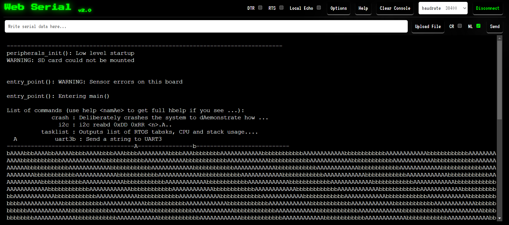
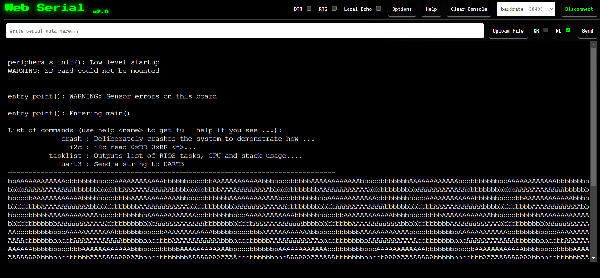
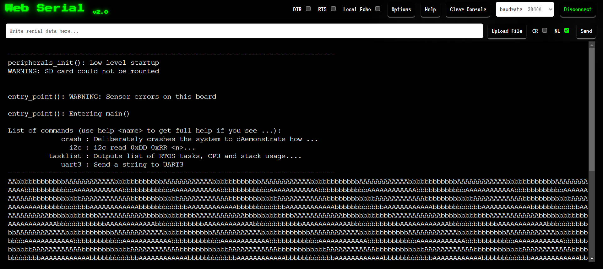

Multiple Tasks Assignment

According to given steps I have performed the tasks with differnet Priority.
1- Task 1 = 1 (priority value), Task 2 = 1 (priority value).
In this scenario the output here in 1 millisecond there were 3.8 characters were printed. So if there were slight difference occurs in the time the other value get printed. So, thats why we get this output.

2- Task 1 = 1 (priority value), Task 2 = 2 (priority value).
I this scenario also there were 3.8 characters were print in 1ms. So, we have until 3 to 4 characters to come up with values. Sometimes it comes from 3rd character or sometime comes from 4th character.
So here the priority of task 2 is higher so that prints first after 3rd character.

3- Task 1 = 2 (priority value), Task 2 = 1 (priority value).
I this scenario also there were 3.8 characters were print in 1ms. So, we have until 3 to 4 characters to come up with values. Sometimes it comes from 3rd character or sometime comes from 4th character.
So here the priority of task 1 is higher so that prints first after 3rd character.

